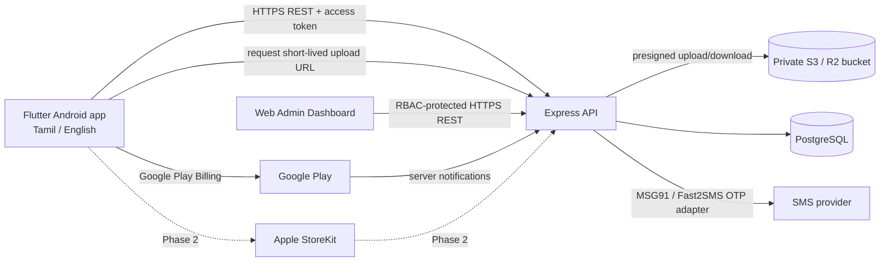
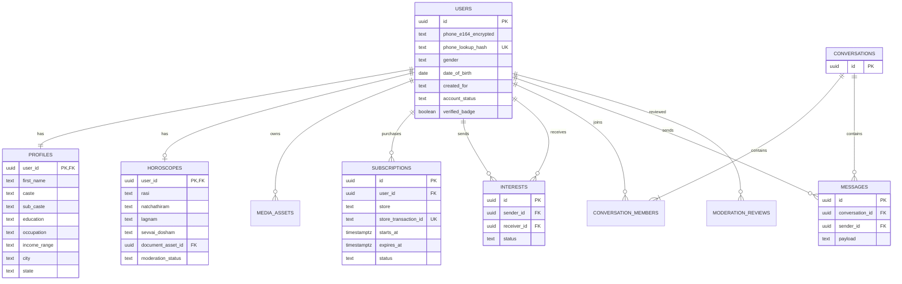

# Anbu Matrimony — Phase 1 Implementation Blueprint

## Part 1: System Architecture & Database Schema

### 1.1 Architecture



The API is the trust boundary: it verifies identity, profile visibility, moderation state, and store entitlements before returning protected data. The app must never decide premium access from a locally stored boolean. Photos and horoscope documents live in private object storage, not public buckets or permanent public URLs. The API issues short-lived, scoped upload/download URLs after authorization.

**Recommended database:** PostgreSQL. The data has clear relationships, uniqueness rules, moderation history, and entitlement transactions. S3-compatible object storage holds media. MongoDB is a possible future alternative, but this initial implementation uses PostgreSQL consistently.

**Important limitations/assumptions:** This scaffold is a secure starting point, not a completed store-ready matrimony service. Configure production secrets, OTP and store verification adapters, admin identity, privacy/legal text, backups, alerting, and load/security testing before launch. Host personal data in the selected Mumbai region as requested, after confirming the provider's data-processing terms and current legal requirements.

### 1.2 ERD



`Interests` and `Messages` are separate normalized entities: an interest has a pending/accepted/rejected state, while each chat message is an immutable event in a conversation. This avoids making message status ambiguous and permits independent moderation, retention, and rate limiting.

The executable schema is [001_initial_schema.sql](../server/migrations/001_initial_schema.sql). It includes users, profiles, horoscopes, moderated media, store subscriptions, interests, conversations/messages, reports, and moderation audit records. Phone numbers must be encrypted using a managed key and uniquely indexed by a keyed lookup hash; never store OTP codes or provider secrets in the database.

### 1.3 Data and access rules

- Enforce the stated minimum account ages server-side: women 18+, men 21+; obtain legal review before launch and reject unknown/invalid DOB.
- Validate five outgoing interests per free user per India-local calendar day in a transactional API operation; premium users are not subject to that free-tier cap. Clients cannot self-enforce the limit.
- Do not return contact fields, private media keys/URLs, or full horoscope fields to a free user. Check an active, verified 90-day entitlement on every request.
- A purchase is not active until verified with Google/Apple server APIs or authenticated store notifications. Persist the original transaction identifiers idempotently; never trust a client-reported SKU/expiry.
- Keep profile text and member-facing fields separate from admin-only identity documents. Government ID is optional; restrict access, record reviewer/audit metadata, and delete document bytes after verification according to the approved retention policy.
- Record consent, deletion requests, retention periods, backup purge behavior, admin access, and data exports in the production privacy design.

## Part 2: Flutter Codebase Architecture

### 2.1 Proposed directory structure

```text
mobile/
  pubspec.yaml
  l10n.yaml
  lib/
    main.dart
    app/
      app.dart
      router.dart
      theme.dart
    core/
      api/api_client.dart
      auth/session.dart
      billing/entitlement_repository.dart
      security/profile_screen_security.dart
      localization/locale_controller.dart
    features/
      auth/{data,domain,presentation}/
      profile/{data,domain,presentation}/
      discovery/{data,domain,presentation}/
      interests/{data,domain,presentation}/
      messaging/{data,domain,presentation}/
      subscription/{data,domain,presentation}/
      moderation/{data,domain,presentation}/
  assets/
    i18n/en.json
    i18n/ta.json
  android/app/src/main/kotlin/com/anbumatrimony/app/MainActivity.kt
  ios/Runner/AppDelegate.swift
```

Flutter framework localization and generated `AppLocalizations` are the recommended production path. The supplied JSON dictionaries are starter copy, not a substitute for native review of Tamil translations.

The entitlement helper is [profile_access.dart](../mobile/lib/features/profile/domain/profile_access.dart), and the conditional profile-content/blur widget is [premium_access_gate.dart](../mobile/lib/features/profile/presentation/premium_access_gate.dart). UI gating improves experience only; the backend must independently enforce exactly the same policy and must not deliver protected photo URLs or contact data to a free account.

### 2.2 Screenshot and recording protection

[ProfileScreenSecurity](../mobile/lib/core/security/profile_screen_security.dart) calls a platform channel when entering/leaving protected screens. Android sets and clears `WindowManager.LayoutParams.FLAG_SECURE` in [MainActivity.kt](../mobile/android/app/src/main/kotlin/com/anbumatrimony/app/MainActivity.kt). This reduces Android screenshots and screen recording while enabled; it cannot stop photography with another device. iOS has no supported API that reliably blocks screenshots. Apps can detect some capture/recording states and react, but cannot promise prevention. Do not represent iOS as screenshot-proof.

### 2.3 Billing and iOS readiness

Keep product identifiers, purchase verification, and entitlement policy behind platform-neutral Dart interfaces. Use Google Play Billing on Android and `in_app_purchase`/StoreKit on iOS, then verify transactions on the API before granting access. A three-month fixed, non-renewing pass is an implementation/product configuration decision: confirm that the selected store product type supports the desired 90-day duration and territory pricing before building checkout. No auto-renewal is intended.

Phase 1 should keep platform-specific code behind channels/plugins and test both Android and iOS builds continuously. Publishing-only iOS work cannot be guaranteed: StoreKit configuration, Apple signing/builds, privacy labels, permissions, review, and any platform integration differences still require testing and may require changes.

## Part 3: Store Launch Checklists

### 3.1 Google Play production

1. Create the Play Console account under the app owner's legal entity; enable least-privilege developer access.
2. Finalize unique package ID, supported countries/languages, age rating, app access instructions, content rating, and target SDK.
3. Configure release signing and Play App Signing; keep upload keys and recovery credentials in controlled storage.
4. Publish a privacy policy and complete Data safety, ads, account deletion, data deletion, and user-generated-content moderation declarations accurately for every SDK and data flow.
5. Configure the 90-day pass and localized price/offer in Play Console. Verify whether the intended duration is available for the chosen non-renewing in-app product; do not assume a subscription product accepts a custom 90-day term.
6. Integrate Google Play Billing; validate purchase tokens with Google Play Developer APIs on the server. Process Real-time Developer Notifications idempotently and reconcile expiry, refund, and revocation state.
7. Test purchases using license testers/internal testing tracks, including restore/reinstall, duplicate notifications, expiry, refund, failed verification, and offline launch.
8. Review screenshot restriction, permissions, account deletion, OTP delivery, moderation, Tamil translations, accessibility, and performance on real devices.
9. Produce a signed Android App Bundle (AAB); upload to internal/closed testing, address Play pre-launch report issues, then submit production rollout.
10. Monitor crashes, ANRs, billing notifications, OTP delivery, moderation queue, and support reports after launch.

### 3.2 Apple App Store future-proofing

1. Keep a client-owned Apple Developer Program membership and App Store Connect account ready; configure bundle identifier, signing, and provisioning in the iOS project.
2. Preserve a platform-neutral purchase/entitlement API and implement a StoreKit adapter; test StoreKit transactions and server-side App Store Server Notifications before launch.
3. Review App Store Guideline 3.1.1: digital app functionality/subscriptions generally require In-App Purchase unless a current exception applies. Confirm a non-renewing 90-day product and territory pricing with current App Store Connect rules.
4. If a third-party/social login (e.g., Google) is offered as the primary account login, assess Guideline 4.8 and add Sign in with Apple when required. Phone OTP alone is not automatically a third-party social login; review the final login choices against current guidelines.
5. Provide privacy disclosures, account deletion, support URL, review credentials, subscription terms, moderation/report/block flows, and accurate App Privacy details.
6. Test on supported iOS devices, including permissions, StoreKit purchase/restore, notifications, deep links, VoiceOver, Tamil localization, and screenshot/recording behavior.
7. Submit through App Store Connect, respond to review feedback, and phase rollout while monitoring crash and purchase metrics.

## Part 4: Excel Launch Checklist

The two-platform launch checklist is maintained separately from this source repository. It has separate Android and iOS tabs with ordered actions, phase, owner, evidence/verification, status dropdown, notes, and platform-specific payment and privacy checks. Treat store policies as subject to change and reconfirm them at submission time.
